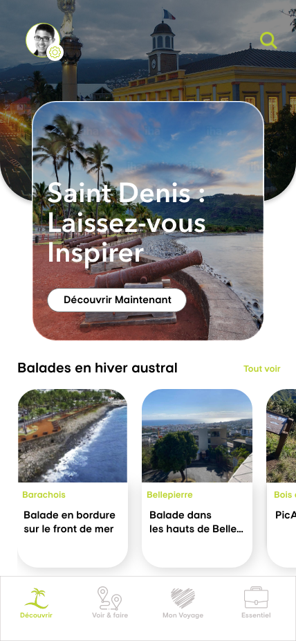
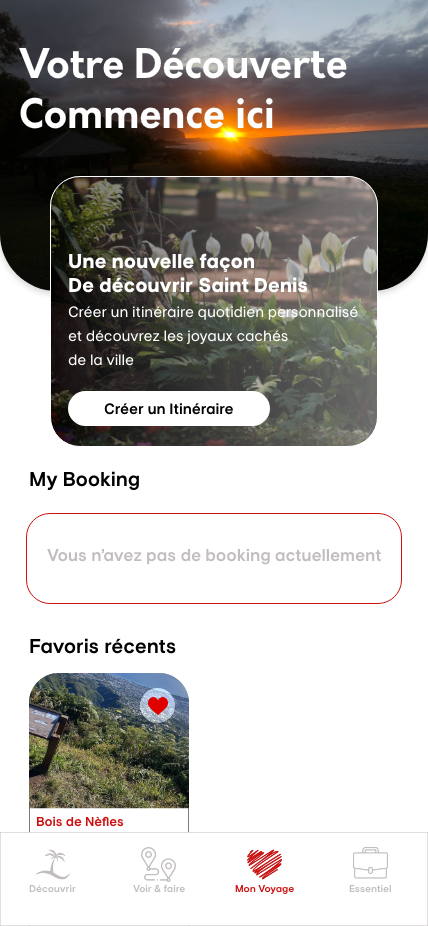
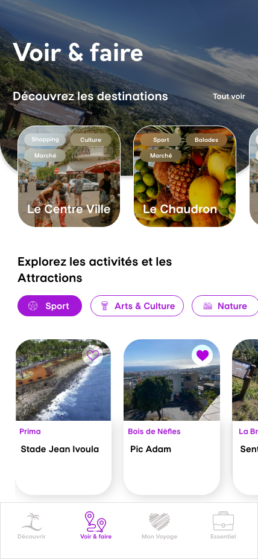

# VisiteSD
## Visite Saint-Denis (Ile de La Réunion)

VisiteSD est une solution applicative (back-end et iOS) complètement developpé en Swift.  

L'objectif de ce projet est double. 

1. Pouvoir développer une solution applicative (Back-end & application iOS) seulement avec le langage Swift
2. Proposer à tous les voyageurs, touristes, habitant de Saint Denis un service qui leurs permettraient de (re)découvrir cette ville

## Backend 

### Les technologies utilisées
* Vapor : 
* Fluent : 
* Leaf : 
* Js : 
* Html : 
* CSS : 

### Hébergement

AWS : 

### Liste des fontionnalités 

* Developpeemnt d'un back-end (full CRUD)
* Developpement des API pour l'application iOS 

## Application iOS

### Présentation de l'application
VisiteSD est une application iOS qui permettra à l'ensemble des habitants, touristes ou encore voyageurs  de passage sur Saint-Denis, de découvrir des lieux insolite de notre belle ville. (Musée, lieux de Pic-nic, park, airs de jeux...). 
Au fur et à mesure des versions, nous ajouterons des fonctionnalités.  

### WireFrame 
  

### Liste des fonctionnalités

* Découvrir : lorsque l'utilisateur ouvre l'application c'est la première vue qu'il accède. Ici il peut avoir accés à tous les event, produits, services, lieux... mise en avant par la plateforme. 
* Voir & Faire : Une liste de propostion d'activité en fonction des thèmes
* Mon Voyage : Vous preparez un voayage à La Reunion ? Passage indispensable par Saint-Denis. Préparez vous ! Ici vous pouvez organiser vos excurtions, vos moments détentes... 
* Essentiel : Retrouvez toutes les infos utiles de la Ville. 
